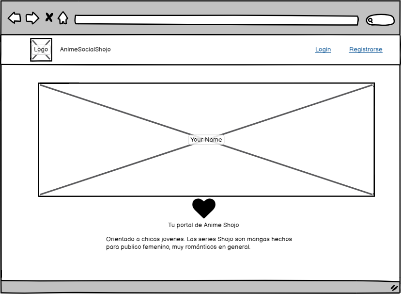
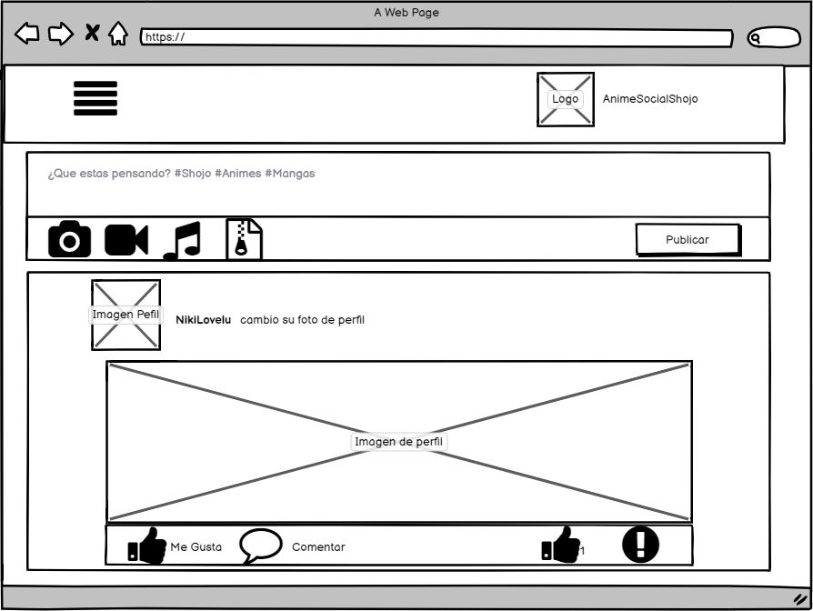
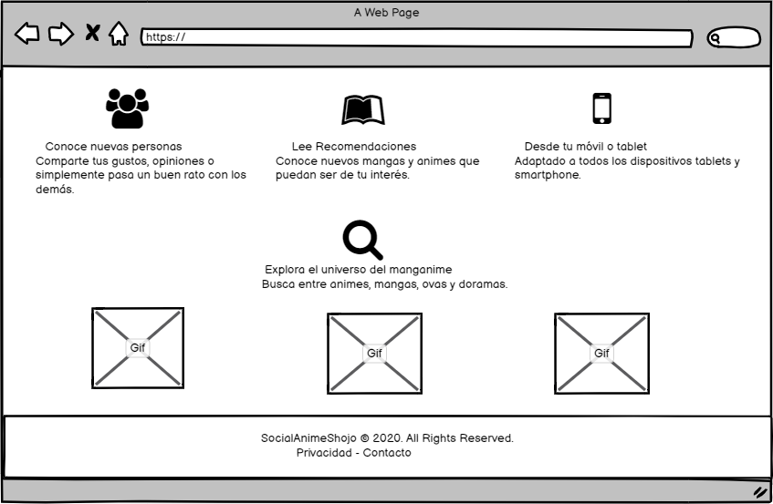
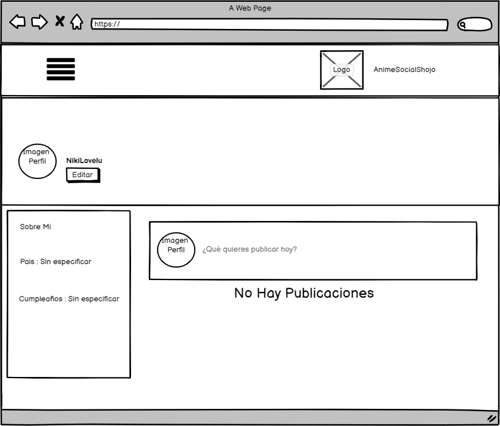
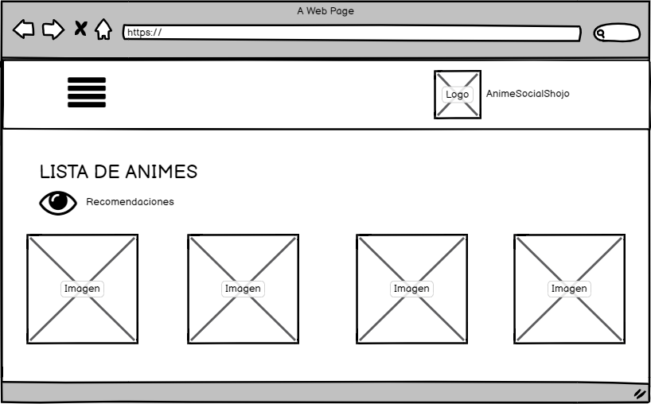
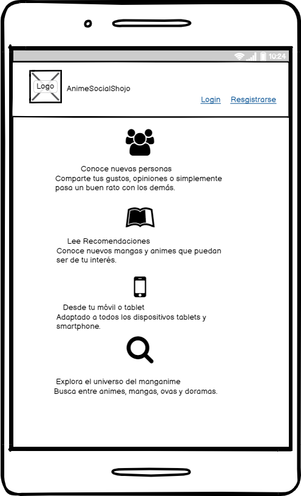
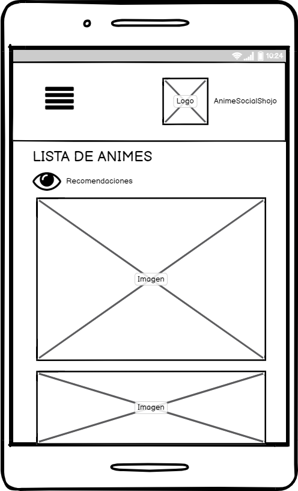

# ShojoAnimeSocial

## Índice

- [ShojoAnimeSocial](#shojoanimesocial)
  - [Índice](#índice)
  - [1. Preámbulo](#1-preámbulo)
  - [2. Resumen del desarrollo del proyecto](#2-resumen-del-desarrollo-del-proyecto)
  - [3. Carpetas que encontrarás en el repositorio](#3-carpetas-que-encontrarás-en-el-repositorio)
  - [SRC](#src)
    - [CSS](#css)
    - [Imagenes](#imagenes)
    - [LIB](#lib)
  - [TEST](#test)
  - [README](#readme)
    - [Recursos visuales](#recursos-visuales)
  - [4. Sketch inicial - Baja fidelidad](#4-sketch-inicial---baja-fidelidad)
  - [5. Sketch Final - Alta fidelidad](#5-sketch-final---alta-fidelidad)
  - [6. Planning del proyecto](#6-planning-del-proyecto)
  - [7. Objetivos de aprendizaje](#7-objetivos-de-aprendizaje)
    - [HTML y CSS](#html-y-css)
    - [DOM y Web APIs](#dom-y-web-apis)
    - [JavaScript](#javascript)
    - [Testing](#testing)
    - [Estructura del código y guía de estilo](#estructura-del-código-y-guía-de-estilo)
    - [Git y GitHub](#git-y-github)
    - [Firebase](#firebase)
    - [UX](#ux)

## 1. Preámbulo

Este es el tercer proyecto que desarrollamos en el Bootcamp de [Laboratoria], propusimos una pagina donde simulamos una red social llamada [ShojoAnimeSocial]
El objetivo principal de aprendizaje de este proyecto es construir una
[Single-page Application (SPA)], (con más de una vista / página) en la que podamos **leer y escribir datos.**.

## 2. Resumen del desarrollo del proyecto

Tras leer el [README] hicimos un sketch de baja fidelidad en balsamiq y un sketch de alta fidelidad en figma, donde  se llevó a cabo una sesión de feedback todos los martes en cada sprint donde tuvimos la oportunidad de hacer mejoras prontas al prototipo de alta fidelidad.
Forkeamos el proyecto base, lo desarrollamos localmente, desarrollamos la estructura básica en html, luego nos enfocamos en JavaScript mientras generabamos recursos visuales e interactuábamos con CSS y asi mismo nos efocamos en manipular las funciones para testearlas.

## 3. Carpetas que encontrarás en el repositorio

## SRC

### CSS
 | Archivo       | Descripción             |
 | :------------ | :---------------------- |
 | animes.css    | Estilos de animes       |
 | cssPerfil.css | Estilos vista perfil    |
 | logueado.css  | Estilo vista logueado   |
 | style.css     | Estilos vista principal |
 
### Imagenes
Carpeta con material visual utilizado en el cuerpo del proyecto

### LIB
 | Archivo     | Descripción                 |
 | :---------- | :-------------------------- |
 | animes.js   | Vista de animes             |
 | header.js   | Vista Inicial de las vistas |
 | login.js    | Vista de logueo             |
 | perfil.js   | Vista de perfil de usuario  |
 | registro.js | Vista de registro           |
 | vistaLg.js  | Vista de Inicio de logueado |

 | Archivo    | Descripción      |
 | :--------- | :--------------- |
 | Index.html | Html Principal   |
 | main.js    | js principal     |
 | router.js  | Router manejable |

 ## TEST

 | Archivo       | Descripción                                                         |
 | :------------ | :------------------------------------------------------------------ |
 | index.spec.js | Test Unitarios de las funciones implementadas en el archivo data.js |

## README

 | Archivo   | Descripción                                         |
 | :-------- | :-------------------------------------------------- |
 | Readme.md | Informacion del proyecto y objetivos de aprendizaje |

### Recursos visuales

| Carpeta  | Descripción                                                     |
| :------- | :-------------------------------------------------------------- |
| Imagenes | Carpeta con material visual utilizado en el cuerpo del proyecto |

## 4. Sketch inicial - Baja fidelidad

## 5. Sketch Final - Alta fidelidad

## 6. Planning del proyecto

Utilizamos [Trello] como herramienta de coordinación para el óptimo desarrollo del proyecto, para verlo da click [aquí](https://trello.com/b/LR4mCakX/socialanimeshojo).

## 7. Objetivos de aprendizaje

El objetivo principal de aprendizaje de este proyecto es construir una
[Single-page Application (SPA)](https://es.wikipedia.org/wiki/Single-page_application)
[_responsive_](https://github.com/Laboratoria/curricula-js/tree/master/topics/css/02-responsive)
 (con más de una vista / página) en la que podamos **leer y escribir datos.**

### HTML y CSS

* [X] [Uso de HTML semántico.](https://developer.mozilla.org/en-US/docs/Glossary/Semantics#Semantics_in_HTML)
* [X] Uso de selectores de CSS.
* [X] Construir tu aplicación respetando el diseño realizado (maquetación).
* [X] [Uso de flexbox en CSS.](https://css-tricks.com/snippets/css/a-guide-to-flexbox/)

### DOM y Web APIs

* [X] Uso de selectores del DOM.
* [X] Manejo de eventos del DOM.
* [X] [Manipulación dinámica del DOM.](https://developer.mozilla.org/es/docs/Referencia_DOM_de_Gecko/Introducci%C3%B3n)
(appendChild |createElement | createTextNode| innerHTML | textContent | etc.)
* [ ] [History API.](https://developer.mozilla.org/es/docs/DOM/Manipulando_el_historial_del_navegador)
* [ ] [localStorage.](https://developer.mozilla.org/es/docs/Web/API/Window/localStorage)

### JavaScript

* [X] Uso de condicionales (if-else)
* [X] Uso de condicionales (switch | operador ternario)
* [ ] Uso de bucles (for | for..in | for..of | while)
* [X] Uso de bucles (while)
* [X] Uso de funciones (parámetros)
* [X] Uso de funciones (argumentos | valor de retorno)
* [ ] Manipular arrays (filter | map | sort | reduce)
* [ ] Manipular objects (key | value)
* [X] Uso ES modules ([`import`](https://developer.mozilla.org/en-US/docs/Web/JavaScript/Reference/Statements/import)
| [`export`](https://developer.mozilla.org/en-US/docs/Web/JavaScript/Reference/Statements/export))
* [ ] Diferenciar entre expression y statements.
* [ ] Diferenciar entre tipos de datos atómicos y estructurados.
* [ ] Diferenciar entre tipos de datos primitivos y no primitivos.
* [ ] [Uso de callbacks.](https://developer.mozilla.org/es/docs/Glossary/Callback_function)
* [ ] [Consumo de Promesas.](https://scotch.io/tutorials/javascript-promises-for-dummies#toc-consuming-promises)

### Testing

* [X] [Testeo unitario.](https://jestjs.io/docs/es-ES/getting-started)
* [ ] [Testeo asíncrono.](https://jestjs.io/docs/es-ES/asynchronous)
* [ ] [Uso de librerias de Mock.](https://jestjs.io/docs/es-ES/manual-mocks)

### Estructura del código y guía de estilo

* [X] Organizar y dividir el código en módulos (Modularización)
* [X] Uso de identificadores descriptivos (Nomenclatura | Semántica)
* [ ] Uso de linter (ESLINT)

### Git y GitHub

* [X] Uso de comandos de git (add | commit | pull | status | push)
* [X] Manejo de repositorios de GitHub (clone | fork | gh-pages)
* [ ] Colaboración en Github (branches | pull requests | |tags)
* [ ] Organización en Github (projects | issues | labels | milestones)

### Firebase

* [X] [Firestore.](https://firebase.google.com/docs/firestore)
* [X] [Firebase Auth.](https://firebase.google.com/docs/auth/web/start)
* [ ] [Firebase security rules.](https://firebase.google.com/docs/rules)
* [ ] Observadores. ([onAuthStateChanged](https://firebase.google.com/docs/auth/web/manage-users?hl=es#get_the_currently_signed-in_user)
 | [onSnapshot](https://firebase.google.com/docs/firestore/query-data/listen#listen_to_multiple_documents_in_a_collection))

### UX

* [X] Diseñar la aplicación pensando y entendiendo al usuario.
* [X] Crear prototipos para obtener feedback e iterar.
* [ ] Aplicar los principios de diseño visual (contraste alineación, jerarquía)
* [ ] Planear y ejecutar tests de usabilidad.